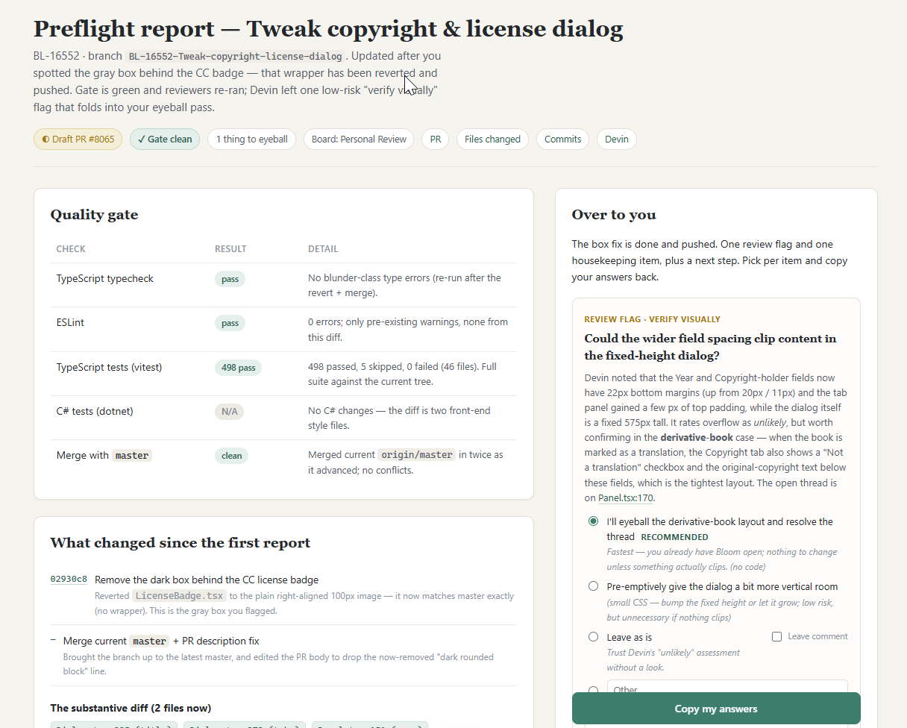

# bloom-team-skills

Agent skills for the Bloom team's development workflow, used across various repositories.

## /preflight

The Bloom Team development process with `preflight`:

1. When you're done coding, run /preflight, then step away and work on something else.
2. Come back in half an hour to a draft PR—one that's as solid as repeated loops through all the tools, tests, and bots can make it.
3. Review the draft PR yourself, looping back to step 1 until you're happy with it.
4. Mark the PR "Ready for Review" and get a peer review.
5. Loop back to step 1 until a human merges it.

### The Preflight Process


When you're done with a fix or feature, run `/preflight`. It will:

1. **Typecheck, lint, and run the affected tests**, fixing what's safely fixable.
2. Do a **local code review** and loop until the only issues left need your input (but it won't ask yet). By default that's a light single-pass review; ask for a "thorough review" to get the full `/code-review` + fix loop, or "without review" to skip it.
3. **Integrate the base branch first** — commit the work, then merge the base in so the code is tested and pushed _as it will actually merge_ (this catches breakage from base changes even when there's no git conflict). Trivial conflicts it resolves itself; semantic ones go in your report.
4. **Push and create a draft PR** if it isn't already there.
5. Find the related issue in the issue tracker (we use YouTrack) and add a **comment with the PR URL** if it isn't already there.
6. **Trigger Devin** and start watching for other **review-bot feedback** and **CI** on the PR.
7. Run the front- and back-end **full test suite**, overlapped with the wait; failures are fixed if safe, else reported.
8. **Poll until every reviewer is done or timed out** — findings that are safe and clear it just fixes (re-running the gate and re-triggering the bots on each new commit); the rest are saved for your report. Every finding it acts on — bot or human — gets a reply on the PR documenting what it did and has its thread resolved, so human reviewers can see it was dealt with. (Devin's findings are mirrored onto the PR as inline review threads first.) The ones it escalates to your report keep their threads open until you decide.
9. On the issue (YouTrack), add or update **a small report for testers** — an overview of what changed plus a set of manual testing ideas: normal cases, boundary cases, how it might interact with other parts of the Bloom ecosystem ([example](https://issues.bloomlibrary.org/youtrack/issue/BL-16548/UI-Tweaks-to-collections-dialog#focus=Comments-102-73983.0-0)).
10. Hand back a preflight report:

### The preflight report

Preflight's final gift is a single report, auto-opened in your browser, that is easy to scan and interact with. Live examples: [Simple](https://claude.ai/code/artifact/cf50955d-f453-4be3-8dba-463441d83f22?org=0fe551b1-bdb7-47b7-8485-186bf7fec15e), [Complex](https://claude.ai/code/artifact/a9e185bf-3367-4933-ac22-e3ddbe60806a?org=0fe551b1-bdb7-47b7-8485-186bf7fec15e) (Sorry, Anthropic limits our artifacts to SIL Global subscribers — the screenshot below shows the gist).



 It has these parts:
- **Header** — a one-line summary of the run and a row of status chips (draft PR count, mergeability, bots clean, how many items are waiting on you).
- **Quality gate** — a table of typecheck, lint, and merge-cleanliness, with **tests broken out one row per language/runner** (TS/vitest, C#/dotnet, …) so nothing looks silently skipped; each row shows pass / fail / N/A with detail.
- **What changed this run** — each commit (linked to its GitHub page, with `file:line` deep links) plus an "also done without needing you" list of the small stuff it handled on its own.
- **Reviewer outcomes** — one row per reviewer, **local review first** (labeled with the level that ran and what it found), then each remote bot, Devin, and CI. Every row is in a **terminal state** — "complete" with its findings, or "timed out after N min" — never "pending."
- **Decision items** — the things that need you, each written for a reader with zero context: what the situation is, why it happens, and why it may or may not matter. Each offers ranked choices as radio buttons (recommended one pre-selected, with a fix-complexity note), an always-present `Leave as is` option with a `Leave comment` checkbox, an `Other:` free-text box, and a notes field.
- **Copy-back** — one button that serializes every choice, note, and `Other:` answer into a plaintext block you paste straight back into the session for preflight to act on.

## Other skills in this repo

| Skill                      | What it does                                                                                                                                                                            |
| -------------------------- | --------------------------------------------------------------------------------------------------------------------------------------------------------------------------------------- |
| `pr-ready-for-human`       | Step 3 of the pipeline: after preflight and your own review, verify clean, link YouTrack, un-draft the PR, move boards.                                                                 |
| `devin-review`             | Single source of truth for operating Devin (devinreview.com / app.devin.ai): trigger, read signals, post findings to GitHub.                                                            |
| `reviewable-replies`       | Reply to Reviewable.io review discussions per-thread via the `reviewable` CLI.                                                                                                          |
| `youtrack-api`             | Low-level: auth and REST conventions for our YouTrack (`issues.bloomlibrary.org`).                                                                                                      |
| `youtrack-fix`             | Fix an issue given a `BL-xxxxx` id: plan, branch, implement, commit.                                                                                                                    |
| `youtrack-create-issue`    | File a new bug/task/card on the right board in the right state.                                                                                                                         |
| `bloom-youtrack-reporting` | Query and report across YouTrack issues.                                                                                                                                                |
| `papercut`                 | Log small dev/agent/tooling friction to a per-repo `PAPERCUTS.md` without derailing the task; trim mode triages the backlog.                                                            |
| `add-test-ideas`           | Write manual test ideas / a QA test plan for a tester: leads with a plain-language explanation of how the feature works, then do-this-expect-that ideas, then the risky parts to watch. |
| `decision-form`            | Present a batch of decisions as an interactive artifact — radios with a recommended pick, notes, `Other:`, and a copy-back block — instead of snap-judgment terminal questions.         |
| `update-team-skills`       | Pull the latest bloom-team-skills and symlink any newly added skill into `~/.claude/skills`. Run `/update-team-skills` after someone adds a skill; replaces the manual re-link chore.   |

## Installation

### Prerequisites — tools

Install these once so the skills have everything they reach for. Not every skill needs every
tool; the "for" column says which ones.

| Tool                                                 | For                                               | Notes                                                                                                                                                                                                                                                                                                                                                                                      |
| ---------------------------------------------------- | ------------------------------------------------- | ------------------------------------------------------------------------------------------------------------------------------------------------------------------------------------------------------------------------------------------------------------------------------------------------------------------------------------------------------------------------------------------ |
| [\*\*GitHub CLI](https://cli.github.com/) (`gh`)\*\* | `preflight`, `pr-ready-for-human`, `devin-review` | Authenticate once with `gh auth login`.                                                                                                                                                                                                                                                                                                                                                    |
| `**reviewable` CLI\*\*                               | `reviewable-replies`                              | Install globally: `npm install -g reviewable`. See the [Reviewable agent/CLI docs](https://docs.reviewable.io/agents).                                                                                                                                                                                                                                                                     |
| **`chrome-devtools` CLI**                            | `devin-review` browser automation                 | Only needed for `devin-review`, which drives the [Chrome DevTools for agents](https://developer.chrome.com/docs/devtools/agents) **CLI** (not the MCP-server form). Install it globally: `npm i chrome-devtools-mcp@latest -g` (needs Node.js — this puts a `chrome-devtools` binary on your PATH). Verify with `chrome-devtools status`. Works in any environment; no `/plugin` required. |

### Prerequisites — environment variables

Set these in your user environment (never commit them — see [Ground rules](#ground-rules)).

| Variable                   | What                                | How to get it                                                                                                                   |
| -------------------------- | ----------------------------------- | ------------------------------------------------------------------------------------------------------------------------------- |
| `**YOUTRACK**`             | YouTrack permanent token (`perm-…`) | In YouTrack: avatar → **Profile** → **Account Security** → **New token…**, scope **YouTrack**. Used by every YouTrack skill.    |
| `**REVIEWABLE_API_TOKEN**` | Reviewable agent token (`rvbl_…`)   | In Reviewable: **Account settings** → **Provision new agent** → choose the **Author** agent type. Used by `reviewable-replies`. |
| `**REVIEWABLE_URL**`       | `https://reviewable.io`             | Constant. Used by `reviewable-replies`.                                                                                         |

### Set up the skills

Agents discover skills from your personal `~/.claude/skills` directory, so each skill folder here
needs a symlink there. You don't have to do that by hand — **let the `update-team-skills` skill do
it.**

1. **Clone the repo** wherever you keep repos:

   ```bash
   git clone https://github.com/BloomBooks/bloom-team-skills
   ```

2. **Open Claude Code in that folder and ask it to set up the skills** — e.g.:

   > Read `update-team-skills/SKILL.md` and follow it to set up the team skills.

   It finds the clone from that file's own location, then symlinks every skill folder (including
   itself) into `~/.claude/skills`. On **Windows** turn on **Developer Mode** first (Settings →
   Privacy & security → For developers) or run in an elevated shell, or the symlink step can't
   create links — the skill reports that clearly if it hits it.

3. **Restart Claude Code** so the newly linked skills are discovered.

After that, `/update-team-skills` is a real slash command: run it any time to pull the latest and
link any newly added skill (idempotent; safe to re-run). The author of a new skill runs it too,
since their own commit doesn't trigger a pull.

<details>
<summary>Prefer to link them by hand (no Claude)?</summary>

Run the equivalent loop yourself after cloning — it only links folders that contain a `SKILL.md`,
leaving docs and other root files alone.

**Windows (PowerShell; needs Developer Mode or an elevated shell):**

```powershell
$repo = (Resolve-Path .).Path   # run from inside the clone
New-Item -ItemType Directory -Force -Path "$HOME\.claude\skills" | Out-Null
Get-ChildItem $repo -Directory | Where-Object { Test-Path "$($_.FullName)\SKILL.md" } | ForEach-Object {
  New-Item -ItemType SymbolicLink -Path "$HOME\.claude\skills\$($_.Name)" -Target $_.FullName
}
```

**macOS / Linux (run from inside the clone):**

```bash
repo="$PWD"
mkdir -p ~/.claude/skills
for d in "$repo"/*/; do
  [ -f "$d/SKILL.md" ] && ln -s "$d" ~/.claude/skills/"$(basename "$d")"
done
```

(Existing links keep working since they point at folders. Skills for other agent tools that read a
different directory can be linked the same way.)

</details>

### Load the team-wide agent rules

This repo also carries [`TEAM-AGENTS.md`](TEAM-AGENTS.md) — the few rules that should be
active in **every** repo and session (currently: proactively logging papercuts). Skills only
activate when a request matches them; always-on behavior has to live in context that's loaded
each session. Wire it up once by adding a line to your personal global `~/.claude/CLAUDE.md`,
pointing at your clone:

```
@C:/dev/bloom-team-skills/TEAM-AGENTS.md
```

This import reaches Claude Code only; agents that don't read your global CLAUDE.md (Copilot,
Devin, …) get the same guidance from per-repo `AGENTS.md` rules where those exist.

## Making the review skills actually autonomous (auto-mode setup)

`preflight` and `devin-review` say "invoking this skill IS your permission" to write to GitHub.
That is **intent** authorization — it tells the _agent_ not to stop and ask "should I publish
this?". It is **not** the same as **harness** permission, and a skill cannot grant itself the
latter. If you run in **auto mode** (`permissions.defaultMode: "auto"`), the auto-mode
_classifier_ is a separate safety gate that will still **deny** the outward-facing `gh` writes
these skills depend on — posting PR comments/reviews, resolving review threads, the "Consulted
Devin …" log comment — with a message like _"denied by the Claude Code auto mode classifier."_
When that happens the skill can't finish the job autonomously: it surfaces the finding in its
report and waits for you instead.

To let these run unattended, add one of the following to your **user** settings
(`~/.claude/settings.json`). Both are personal setup, so they live in your own settings, not in
this repo.

**Option A — teach the classifier (recommended; keeps the guard).** The classifier still runs
and still scrutinizes genuinely dangerous `gh` calls (a `DELETE`, deleting a release/repo); it
just stops denying PR-comment/review writes:

```json
"autoMode": {
  "allow": [
    "$defaults",
    "gh commands that post comments or reviews to GitHub pull requests (gh pr comment, gh pr review, gh api .../pulls/.../comments), and gh api graphql calls that resolve review threads"
  ]
}
```

**Option B — allow-list the commands (more deterministic, broader).** With
`autoMode.classifyAllShell` at its default (`false`), commands matching a `permissions.allow`
rule skip the classifier entirely:

```json
"permissions": {
  "allow": [
    "Bash(gh pr comment:*)",
    "Bash(gh pr review:*)",
    "Bash(gh api repos/BloomBooks/BloomDesktop/:*)",
    "Bash(gh api graphql:*)"
  ]
}
```

Notes:

- A settings change may need a **reload** to take effect — open `/hooks` once (that reloads
  config) or restart the agent if the next write is still blocked.
- If you _don't_ run in auto mode, you don't need this: you'll simply get a normal permission
  prompt to approve each write. This setup only matters for unattended / auto-mode runs.
- `git commit`/`git push` are generally allowed already; the gap in practice is the GitHub
  **API/PR-comment** writes above.

## Ground rules

- **Never commit a token or secret here** — this repo is public. Skills reference tokens only
  by environment variable name (`$YOUTRACK`, `REVIEWABLE_API_TOKEN`, …).
- Repo-specific skills (build quirks, XLF strings, etc.) stay in that repo's
  `.github/skills/`; this repo is for cross-repo team workflow.
- Skills that touch a developer's _personal_ setup (e.g. a private board) stay in that
  developer's own `~/.claude/skills` — these skills only reference such a skill by name
  (`personal-board`) and degrade gracefully when it's absent.
